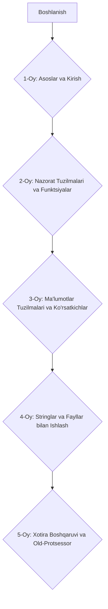

Keling, siz uchun 5 oylik C++ dasturlash kursining batafsil ish rejasini tuzib chiqamiz, unda **OOP (Obyektga yo'naltirilgan dasturlash)** qismigacha bo'lgan mavzular qamrab olinadi. Har bir oyga 12 ta dars ajratilgan bo'lib, har bir dars uchun mavzu, qisqacha tavsif va havola (link) beriladi. GitHub MD fayl formatida taqdim etiladi.

-----

# C++ Dasturlash Kursi: IT Foundation (OOP gacha) - 5 Oylik Ish Rejasi

Bu ish reja sizga C++ dasturlash asoslaridan OOP ga qadar bo'lgan bilimlarni 5 oy davomida bosqichma-bosqich o'rganishga yordam beradi. Har bir oy 12 ta darsdan iborat bo'lib, haftasiga taxminan 3 ta darsga to'g'ri keladi. Har bir dars uchun tavsiya etilgan o'quv materiallari havolalar orqali berilgan.

## 📅 Umumiy Jadval Diagrammasi

-----

## 💡 1-Oy: Asoslar va Kirish

Bu oyda C++ dasturlash tiliga kirish, dasturlash muhitini sozlash, asosiy sintaksis va o'zgaruvchilar bilan ishlash o'rganiladi.

| Dars № | Mavzu 📚 | Qisqacha Tavsif ✨ | Havola 🔗 |
|---|---|---|---|
| 1 | C++ ga kirish va muhitni sozlash | C++ nima, kompilyatorlar (GCC, Clang) va IDE (VS Code, Code::Blocks) o'rnatish. | [GeeksforGeeks: Intro to C++](https://www.google.com/search?q=https://www.geeksforgeeks.org/introduction-to-cpp/) |
| 2 | Birinchi C++ dasturi | `Hello World` dasturini yozish, kompilyatsiya qilish va ishga tushirish. `main` funksiyasi. | [C++ dasturlash: Hello World](https://www.google.com/search?q=https://www.programiz.com/cpp-programming/hello-world) |
| 3 | C++ sintaksisi va kommentariyalar | Asosiy sintaksis qoidalari, bir qatorli va ko'p qatorli kommentariyalar. | [C++ Kommentariyalar](https://www.google.com/search?q=https://www.geeksforgeeks.org/comments-in-cpp/) |
| 4 | O'zgaruvchilar va ma'lumot turlari | `int`, `float`, `double`, `char`, `bool` kabi asosiy ma'lumot turlari. O'zgaruvchilarni e'lon qilish. | [C++ Data Types](https://www.programiz.com/cpp-programming/data-types) |
| 5 | Konstanta o'zgaruvchilar | `const` kalit so'zi, konstantalarning ahamiyati va ulardan foydalanish. | [C++ Constants](https://www.google.com/search?q=https://www.geeksforgeeks.org/constants-in-cpp/) |
| 6 | Operatorlar (Arifmetik va Tayinlash) | Qo'shish, ayirish, ko'paytirish, bo'lish, qoldiq; `=` operatori. | [C++ Arithmetic Operators](https://www.programiz.com/cpp-programming/operators) |
| 7 | Operatorlar (Solish va Mantiqiy) | `==`, `!=`, `<`, `>`, `<=`, `>=` operatorlari; `&&`, `||`, `!` operatorlari. | [C++ Relational Operators](https://www.geeksforgeeks.org/cpp-relational-operators/) |
| 8 | Kiritish/chiqarish (Input/Output) | `std::cout` va `std::cin` orqali ma'lumotlarni konsolga chiqarish va kiritish. | [C++ Input/Output](https://www.programiz.com/cpp-programming/input-output) |
| 9 | Arifmetik amallar ustida amaliyot | O'zgaruvchilar va operatorlar yordamida oddiy hisoblash dasturlari. | [C++ Arifmetik amallar](https://www.w3schools.com/cpp/cpp_operators.asp) |
| 10 | Ma'lumotlarni formatlash | `std::fixed`, `std::setprecision`, `std::setw` kabi manipulyatorlar. | [C++ Output Formatting](https://www.google.com/search?q=https://www.geeksforgeeks.org/iomanip-header-in-cpp/) |
| 11 | Type Casting | Ma'lumot turlarini bir-biriga o'zgartirish (implicit va explicit). | [C++ Type Casting](https://www.google.com/search?q=https://www.geeksforgeeks.org/type-casting-in-cpp/) |
| 12 | 1-oy yakuniy loyihasi | Oddiy kalkulyator dasturi yoki foydalanuvchidan ma'lumot olib chiqaradigan dastur. | *Amaliy loyiha* |

-----

## 🚀 2-Oy: Nazorat Tuzilmalari va Funktsiyalar

Bu oyda dastur oqimini boshqarish uchun shart operatorlari, sikllar va qayta ishlatiladigan kod bloklari bo'lgan funksiyalar o'rganiladi.

| Dars № | Mavzu 📚 | Qisqacha Tavsif ✨ | Havola 🔗 |
|---|---|---|---|
| 13 | `if`, `else if`, `else` shart operatorlari | Dastur oqimini shartga qarab boshqarish. | [C++ If-Else](https://www.programiz.com/cpp-programming/if-else) |
| 14 | Ichma-ich `if-else` va mantiqiy operatorlar | Murakkab shartlar bilan ishlash. | [C++ Nested If-Else](https://www.google.com/search?q=https://www.geeksforgeeks.org/cpp-nested-if-else/) |
| 15 | `switch` operatori | Bir nechta variantdan birini tanlash uchun ishlatish. | [C++ Switch](https://www.google.com/search?q=https://www.programiz.com/cpp-programming/switch) |
| 16 | `for` sikli | Ma'lum bir son marta takrorlanadigan amallar. | [C++ For Loop](https://www.programiz.com/cpp-programming/for-loop) |
| 17 | `while` sikli | Shart bajarilguncha takrorlanadigan amallar. | [C++ While Loop](https://www.google.com/search?q=https://www.programiz.com/cpp-programming/while-loop) |
| 18 | `do-while` sikli | Kamida bir marta bajariladigan sikl. | [C++ Do-While Loop](https://www.programiz.com/cpp-programming/do-while-loop) |
| 19 | `break` va `continue` kalit so'zlari | Sikllarni boshqarish, sikldan chiqish yoki keyingi iteratsiyaga o'tish. | [C++ Break and Continue](https://www.google.com/search?q=https://www.programiz.com/cpp-programming/break-continue) |
| 20 | Funktsiyalarga kirish | Funktsiya nima, e'lon qilish, aniqlash va chaqirish. | [C++ Functions](https://www.google.com/search?q=https://www.programiz.com/cpp-programming/functions) |
| 21 | Funktsiyalar parametrlar bilan | Argumentlarni qabul qiluvchi funksiyalar. | [C++ Function Parameters](https://www.google.com/search?q=https://www.geeksforgeeks.org/function-parameters-in-cpp/) |
| 22 | Qaytish qiymatli funksiyalar | Ma'lumot qaytaruvchi funksiyalar. `void` funksiyalar. | [C++ Return Value](https://www.google.com/search?q=https://www.programiz.com/cpp-programming/functions-return-value) |
| 23 | Funktsiyalarni haddan tashqari yuklash (Overloading) | Bir xil nomdagi, lekin turli parametrlarga ega funksiyalar. | [C++ Function Overloading](https://www.google.com/search?q=https://www.geeksforgeeks.org/function-overloading-in-cpp/) |
| 24 | 2-oy yakuniy loyihasi | Raqamni taxmin qilish o'yini yoki sodda menyu tizimi. | *Amaliy loyiha* |

-----

## 🧠 3-Oy: Ma'lumotlar Tuzilmalari va Ko'rsatkichlar

Bu oyda murakkab ma'lumotlar bilan ishlash uchun massivlar, strukturalar va xotira manzillarini boshqarish uchun ko'rsatkichlar o'rganiladi.

| Dars № | Mavzu 📚 | Qisqacha Tavsif ✨ | Havola 🔗 |
|---|---|---|---|
| 25 | Massivlar (Arrays) | Bir xil turdagi ma'lumotlarning ketma-ket joylashuvi. Massivlarni e'lon qilish. | [C++ Arrays](https://www.programiz.com/cpp-programming/arrays) |
| 26 | Massiv elementlariga kirish va o'zgartirish | Indeks orqali massiv elementlariga murojaat qilish. | [C++ Access Array Elements](https://www.google.com/search?q=https://www.geeksforgeeks.org/accessing-array-elements-in-cpp/) |
| 27 | Ko'p o'lchovli massivlar | Matritsalar kabi ma'lumotlarni saqlash. | [C++ Multidimensional Arrays](https://www.programiz.com/cpp-programming/multidimensional-arrays) |
| 28 | Strukturalar (Structures) | Turli xil ma'lumot turlaridan iborat o'zgaruvchilar guruhi. | [C++ Structures](https://www.programiz.com/cpp-programming/structure) |
| 29 | Struktura o'zgaruvchilari va a'zolariga kirish | Strukturalarni e'lon qilish va ularning a'zolariga ` .  ` operatori orqali kirish. | [C++ Access Structure Members](https://www.google.com/search?q=https://www.geeksforgeeks.org/accessing-structure-members-in-cpp/) |
| 30 | Ko'rsatkichlarga (Pointers) kirish | Xotira manzillarini saqlovchi o'zgaruvchilar. `&` va `*` operatorlari. | [C++ Pointers](https://www.programiz.com/cpp-programming/pointers) |
| 31 | Ko'rsatkichlar va massivlar | Massiv nomlari ko'rsatkich vazifasini bajarishi, ko'rsatkich arifmetikasi. | [C++ Pointers and Arrays](https://www.google.com/search?q=https://www.geeksforgeeks.org/pointers-and-arrays-in-cpp/) |
| 32 | Ko'rsatkichlar va funksiyalar | Funktsiyalarga ko'rsatkichlarni argument sifatida uzatish (pass by reference). | [C++ Pass by Pointer](https://www.google.com/search?q=https://www.programiz.com/cpp-programming/pass-by-address) |
| 33 | Dinamik xotira ajratish (`new` va `delete`) | Dastur bajarilishi vaqtida xotira ajratish va bo'shatish. | [C++ Dynamic Memory Allocation](https://www.google.com/search?q=https://www.programiz.com/cpp-programming/dynamic-memory-allocation) |
| 34 | `NULL` pointer va `nullptr` | Bo'sh ko'rsatkichlar bilan ishlash. | [C++ Null Pointer](https://www.geeksforgeeks.org/null-pointer-in-cpp/) |
| 35 | Referenslar (References) | O'zgaruvchilarga taxallus berish. Ko'rsatkichlardan farqlari. | [C++ References](https://www.programiz.com/cpp-programming/references) |
| 36 | 3-oy yakuniy loyihasi | Talaba ma'lumotlarini massiv va struktura yordamida boshqarish dasturi. | *Amaliy loyiha* |

-----

## 📝 4-Oy: Stringlar va Fayllar bilan Ishlash

Bu oyda matnli ma'lumotlar (stringlar) bilan samarali ishlash va fayllarga ma'lumotlarni yozish/o'qish o'rganiladi.

| Dars № | Mavzu 📚 | Qisqacha Tavsif ✨ | Havola 🔗 |
|---|---|---|---|
| 37 | C-Style Stringlar (char massivlari) | `char` massivlari yordamida matn saqlash. | [C++ C-style Strings](https://www.google.com/search?q=https://www.geeksforgeeks.org/c-style-strings-in-cpp/) |
| 38 | `cstring` kutubxonasi funksiyalari | `strlen`, `strcpy`, `strcat`, `strcmp` kabi funksiyalar. | [C++ cstring Library](https://www.google.com/search?q=https://www.programiz.com/cpp-programming/string-functions) |
| 39 | `std::string` sinfi | C++ da matn bilan ishlashning zamonaviy va qulay usuli. | [C++ std::string](https://www.google.com/search?q=https://www.programiz.com/cpp-programming/string) |
| 40 | `std::string` funksiyalari | `length()`, `empty()`, `append()`, `substr()`, `find()` kabi funksiyalar. | [C++ std::string Functions](https://www.google.com/search?q=https://www.geeksforgeeks.org/string-functions-cpp/) |
| 41 | Stringlarni raqamlarga va raqamlarni stringlarga o'tkazish | `stoi`, `to_string` funksiyalari. | [C++ String to Int / Int to String](https://www.geeksforgeeks.org/convert-string-to-int-in-cpp/) |
| 42 | Fayllar bilan ishlashga kirish | Fayl oqimlari: `ofstream`, `ifstream`, `fstream`. | [C++ File I/O](https://www.google.com/search?q=https://www.programiz.com/cpp-programming/file-io) |
| 43 | Fayl ochish va yopish | `open()` va `close()` funksiyalari. Fayl ochish rejimlarlari. | [C++ Open and Close Files](https://www.google.com/search?q=https://www.geeksforgeeks.org/file-handling-in-cpp/) |
| 44 | Faylga yozish | `<<` operatori yordamida faylga ma'lumot yozish. | [C++ Write to File](https://www.google.com/search?q=https://www.programiz.com/cpp-programming/write-to-file) |
| 45 | Fayldan o'qish | `>>` operatori va `getline()` yordamida fayldan ma'lumot o'qish. | [C++ Read from File](https://www.google.com/search?q=https://www.programiz.com/cpp-programming/read-from-file) |
| 46 | Faylga xato ishlov berish | Fayl ochishda yoki o'qishda yuzaga kelishi mumkin bo'lgan xatolar. | [C++ File Handling Errors](https://www.google.com/search?q=https://www.geeksforgeeks.org/error-handling-in-cpp/) |
| 47 | Ikkilik fayllar bilan ishlash | `read()` va `write()` funksiyalari yordamida ikkilik ma'lumotlarni saqlash. | [C++ Binary Files](https://www.google.com/search?q=https://www.geeksforgeeks.org/reading-and-writing-binary-files-in-cpp/) |
| 48 | 4-oy yakuniy loyihasi | Kontaktlar menejeri (faylga saqlash va o'qish imkoniyati bilan). | *Amaliy loyiha* |

-----

## 🛠️ 5-Oy: Xotira Boshqaruvi va Old-Protsessor

Bu oyda dasturning xotira bilan qanday ishlashi, xatolarni tuzatish va kodni kompilyatsiya qilishdan oldin ishlov berish mexanizmlari o'rganiladi.

| Dars № | Mavzu 📚 | Qisqacha Tavsif ✨ | Havola 🔗 |
|---|---|---|---|
| 49 | Xotira turlari (Stack, Heap, Static, Code) | Dastur xotirasining tuzilishi va har bir qismning vazifasi. | [C++ Memory Layout](https://www.geeksforgeeks.org/memory-layout-of-c-program/) |
| 50 | Xotira sizishi (Memory Leak) va undan qochish | Dinamik ajratilgan xotirani to'g'ri bo'shatmaslik oqibatlari. | [C++ Memory Leaks](https://www.geeksforgeeks.org/memory-leak-in-c-and-how-to-avoid-it/) |
| 51 | Ko'rsatkichlar bilan murakkab amallar | `void*` ko'rsatkichlar, ko'rsatkichlarning ko'rsatkichlari. | [C++ Pointer to Pointer](https://www.google.com/search?q=https://www.geeksforgeeks.org/double-pointer-in-c/) |
| 52 | Old-protsessor direktivalari (`#include`, `#define`) | Kodni kompilyatsiya qilishdan oldin qayta ishlash. | [C++ Preprocessor Directives](https://www.google.com/search?q=https://www.programiz.com/cpp-programming/preprocessor-directives) |
| 53 | Makroslar (`#define` bilan) | Oddiy makroslar va ulardan foydalanish. | [C++ Macros](https://www.google.com/search?q=https://www.geeksforgeeks.org/macros-in-c-cpp/) |
| 54 | Shartli kompilyatsiya (`#ifdef`, `#ifndef`, `#else`, `#endif`) | Ma'lum shartlarga bog'liq holda kod bloklarini kompilyatsiya qilish. | [C++ Conditional Compilation](https://www.google.com/search?q=https://www.geeksforgeeks.org/conditional-compilation-in-c/) |
| 55 | Debugging asoslari | Xatolarni topish va tuzatish vositalari (debuggerlardan foydalanish). | [Debugging C++](https://www.google.com/search?q=https://www.cs.umd.edu/class/spring2003/cmsc214/Notes/chap10.html) |
| 56 | Xatolar turlari (Sintaktik, Mantiqiy, Runtime) | Dasturlashdagi asosiy xato turlari va ularni aniqlash. | [Types of Errors in C++](https://www.google.com/search?q=https://www.geeksforgeeks.org/types-of-errors-in-c-program/) |
| 57 | Header fayllari (`.h` yoki `.hpp`) | Deklaratsiyalarni joylashtirish va kodni modul qilish. | [C++ Header Files](https://www.google.com/search?q=https://www.programiz.com/cpp-programming/header-files) |
| 58 | Namespaces (`std` va shaxsiy namespaces) | Nomlar to'qnashuvini oldini olish. | [C++ Namespaces](https://www.google.com/search?q=https://www.programiz.com/cpp-programming/namespace) |
| 59 | Standart kutubxona konteynerlariga kirish (Vector) | `std::vector` kabi asosiy konteynerlar haqida umumiy tushuncha. | [C++ std::vector](https://www.programiz.com/cpp-programming/vectors) |
| 60 | 5-oy yakuniy loyihasi va OOP ga tayyorlik | Oldingi bilimlarni birlashtiruvchi murakkabroq loyiha. OOP ga o'tish uchun nazariy tayyorgarlik. | *Amaliy loyiha* |

-----

