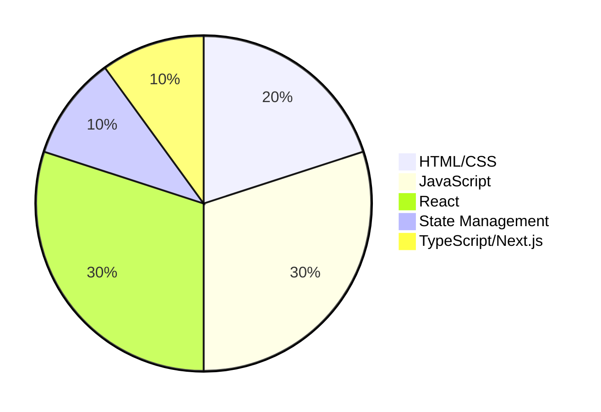

# 💻 Front End Dasturlash Bo'yicha To'liq Kurs Rejasi (10 oy)

Assalomu alaykum\! Ushbu repozitoriyda siz 10 oylik Front End dasturlash kursining to'liq dars rejasini topasiz. Har bir oy 12 ta darsdan iborat bo'lib, web-dasturlashning poydevoridan boshlab, eng zamonaviy texnologiyalargacha bo'lgan bilimlarni o'z ichiga oladi.

-----

## 🎯 Kursning Maqsadi

Ushbu kurs yakunida o'quvchilar mustaqil ravishda zamonaviy web-ilovalar yarata oladigan, ish bozorida talab yuqori bo'lgan **Middle Front End Developer** darajasiga erishadilar. Kurs davomida olingan nazariy bilimlar amaliy loyihalar bilan mustahkamlanadi.

-----

## 🗺️ Kursning Umumiy Rejasi

Bu jadval kurs davomida o'zlashtiriladigan asosiy mavzular va texnologiyalarni umumiy ko'rinishda taqdim etadi.

| Oy | Mavzu | Texnologiyalar |
| :---: | :--- | :--- |
| **1-oy** | 🌐 Web asoslari va HTML | `HTML5`, `Git`, `GitHub`, `VS Code` |
| **2-oy** | 🎨 CSS asoslari | `CSS3`, `Flexbox`, `Grid Layout` |
| **3-oy** | ✨ CSS Preprotsessorlari | `SCSS`, `Sass`, `BEM` |
| **4-oy** | 🟨 JavaScript asoslari | `JS Basics`, `DOM Manipulation` |
| **5-oy** | 🚀 JavaScript o'rta daraja | `ES6+`, `OOP`, `Asynchronous JS` |
| **6-oy** | 🏆 JavaScript yuqori daraja | `API`, `Data Structures`, `Algorithms` |
| **7-oy** | ⚛️ React asoslari | `React`, `JSX`, `Components`, `Props` |
| **8-oy** | 🧭 React Routing va Hooks | `React Router`, `Hooks (useState, useEffect)` |
| **9-oy** | 📦 Redux va State Management | `Redux`, `Redux Toolkit`, `Zustand` |
| **10-oy**| 🔷 TypeScript va Yakuniy Loyiha| `TypeScript`, `Next.js` |

-----

## 📈 Kurs Davomida Egallanadigan Ko'nikmalar (Diagramma)

Quyidagi doiraviy ustunli grafik kurs davomida turli texnologiyalarga ajratilgan vaqt va e'tiborni vizual tarzda ko'rsatadi.

-----

## 🗓️ Oylar Bo'yicha Batafsil Dars Rejasi

Har bir oyning o'ziga xos maqsadlari va o'rganiladigan texnologiyalari bor. Har bir dars uchun mavzu va qo'shimcha ma'lumotlar berilgan.

### **1-oy: 🌐 Web Asoslari va HTML - Webning poydevorini qurish**

Bu oyda webning qanday ishlashi, asosiy HTML elementlari va versiya nazorati tizimi Git bilan tanishiladi.

| Dars № | Mavzu | Qo'shimcha ma'lumotlar | Resurs 💡 |
| :---: | :--- | :--- | :--- |
| 1 | Kirish: Internet va Web qanday ishlaydi? | `HTTP/HTTPS`, Domen, Hosting tushunchalari, Brauzerlar | [MDN: Internet qanday ishlaydi?](https://developer.mozilla.org/en-US/docs/Web/HTTP/Overview) |
| 2 | Dasturlash muhitini sozlash | **VS Code** o'rnatish, `Live Server` plagini, brauzer `dev-tools`dan foydalanish | [VS Code o'rnatish qo'llanmasi](https://code.visualstudio.com/docs/setup/setup-overview) |
| 3 | Git va GitHub asoslari | **Versiya nazorati**, `git init`, `add`, `commit`, `push`, `pull`, `clone` | [Git It About](https://git-scm.com/about) |
| 4 | HTMLga kirish. Hujjat strukturasi | `<!DOCTYPE html>`, `<html>`, `<head>`, `<body>` teglari va ularning maqsadi | [HTML Hujjat strukturasi](https://www.w3schools.com/html/html_basic.asp) |
| 5 | Asosiy HTML teglar | Sarlavhalar (`<h1>`-`<h6>`), paragraflar (`
`), linklar (`<a>`), matn formatlash (`<strong>`, `<em>`) | [HTML Basic Tags](https://www.google.com/search?q=https://www.tutorialrepublic.com/html-tutorial/html-basic-tags.php) |
| 6 | Ro'yxatlar va jadvallar | Tartibli (`<ol>`), tartibsiz (`<ul>`) va tavsiflovchi (`<dl>`) ro'yxatlar; `<table>`, `<tr>`, `<td>`, `<th>` | [HTML Lists and Tables](https://www.w3schools.com/html/html_tables.asp) |
| 7 | Rasmlar, audio va video | ``, `<audio>`, `<video>` teglari va ularning atributlari (`src`, `alt`, `controls`) | [HTML Media](https://www.w3schools.com/html/html_media.asp) |
| 8 | Formalar va inputlar (1-qism) | `<form>`, `<input>` tegi va turli `type` atributlari (`text`, `password`, `email`, `number`) | [HTML Forms](https://www.w3schools.com/html/html_forms.asp) |
| 9 | Formalar va inputlar (2-qism) | `<textarea>`, `<select>`, `<option>`, `<button>`, formani validatsiya qilish (`required`, `pattern`) | [HTML Form Elements](https://www.google.com/search?q=https://www.tutorialspoint.com/html/html_form_elements.htm) |
| 10| Semantik HTML teglari | `<header>`, `<footer>`, `<nav>`, `<main>`, `<section>`, `<article>`, `<aside>` - kontent ma'nosini oshirish | [Semantik HTML](https://www.w3schools.com/html/html5_semantic_elements.asp) |
| 11| `<iframe>` va boshqa teglar | Sahifaga boshqa sayt kontentini joylash, `meta` teglar, favicon | [HTML Iframe](https://www.w3schools.com/html/html_iframe.asp) |
| 12| Amaliyot: Bir sahifali portfolio saytini yaratish | O'tilgan barcha bilimlarni mustahkamlash, GitHub Pages ga deploy qilish | *Amaliy loyiha* |

-----

### **2-oy: 🎨 CSS Asoslari - Saytga ko'rinish berish**

Bu oyda HTML elementlariga stil berish, ularni joylashtirish va responsiv dizayn uchun asos bo'ladigan `Flexbox` hamda `Grid` o'rganiladi.

| Dars № | Mavzu | Qo'shimcha ma'lumotlar | Resurs 💡 |
| :---: | :--- | :--- | :--- |
| 13 | CSSga kirish. Stil berish usullari | **Inline**, **Internal**, **External CSS** usullari, ularning afzallik va kamchiliklari | [CSSga kirish](https://www.w3schools.com/css/css_intro.asp) |
| 14 | Selektorlar (1-qism) | Universal (`*`), Type (`p`), Class (`.my-class`), ID (`#my-id`) selektorlari, ustuvorlik | [CSS Selectors](https://www.w3schools.com/css/css_selectors.asp) |
| 15 | Selektorlar (2-qism) | Atribut (`[type="text"]`), Pseudo-class (`:hover`, `:first-child`), Pseudo-element (`::before`, `::after`) selektorlari | [Advanced CSS Selectors](https://css-tricks.com/almanac/selectors/) |
| 16 | Box Model | Har bir HTML elementi qanday qutichadan iborat: **`margin`**, **`border`**, **`padding`**, **`content`**, `width`, `height` | [CSS Box Model](https://www.w3schools.com/css/css_boxmodel.asp) |
| 17 | Ranglar va fonlar | `color`, `background-color`, `background-image`, `background-repeat`, `background-position` | [CSS Colors and Backgrounds](https://www.w3schools.com/css/css_colors.asp) |
| 18 | Matnlar bilan ishlash | `font-family`, `font-size`, `font-weight`, `text-align`, `line-height`, `text-decoration` | [CSS Fonts and Text](https://www.w3schools.com/css/css_text.asp) |
| 19 | `position` xususiyati | `static`, `relative`, `absolute`, `fixed`, `sticky` - elementlarning sahifadagi joylashuvi | [CSS Position](https://www.w3schools.com/css/css_positioning.asp) |
| 20 | Flexbox (1-qism) | **`display: flex`**, `flex-direction`, `justify-content` - bir o'lchovli layoutlar | [CSS Flexbox Guide](https://css-tricks.com/snippets/css/a-guide-to-flexbox/) |
| 21 | Flexbox (2-qism) | `align-items`, `flex-wrap`, `gap`, `flex-grow`, `flex-shrink`, `align-self` | [Complete Flexbox Guide](https://www.google.com/search?q=https://www.freecodecamp.org/news/flexbox-guide/) |
| 22 | Grid Layout (1-qism) | **`display: grid`**, `grid-template-columns`, `grid-template-rows` - ikki o'lchovli layoutlar | [CSS Grid Layout Guide](https://www.google.com/search?q=https://css-tricks.com/snippets/css/a-complete-guide-to-grid/) |
| 23 | Grid Layout (2-qism) | `grid-gap`, `grid-area`, `grid-auto-flow`, `grid-column-start/end`, `grid-row-start/end` | [Complete CSS Grid Guide](https://www.google.com/search?q=https://www.freecodecamp.org/news/css-grid-tutorial/) |
| 24 | Amaliyot: Murakkab maketni `Flexbox` va `Grid` yordamida yaratish | E-commerce mahsulot kartasi yoki galereya dizayni | *Amaliy loyiha* |

-----

### **3-oy: ✨ CSS Preprotsessorlari va Metodologiyalar - Zamonaviy CSS yozish**

Bu oyda CSS kodini yozishni yanada samarali va tartibli qilish usullari, xususan `SCSS` preprotsessori va `BEM` metodologiyasi o'rganiladi.

| Dars № | Mavzu | Qo'shimcha ma'lumotlar | Resurs 💡 |
| :---: | :--- | :--- | :--- |
| 25 | CSS preprotsessorlari nima? | Nima uchun `Sass/SCSS` kerak? Katta loyihalarda CSSni boshqarish muammolari | [What are CSS Preprocessors?](https://www.google.com/search?q=https://www.geeksforgeeks.org/what-are-css-preprocessors/) |
| 26 | `SCSS` o'rnatish va sozlash | **Node.js** va **npm** orqali Sassni o'rnatish, **`Live Sass Compiler`** plagini (VS Code uchun) | [Sass o'rnatish](https://sass-lang.com/install/) |
| 27 | `SCSS`: O'zgaruvchilar (Variables) | `$primary-color`, `$font-stack` kabi o'zgaruvchilarni yaratish va ulardan foydalanish | [Sass Variables](https://sass-lang.com/documentation/variables) |
| 28 | `SCSS`: Ichma-ich joylashuv (Nesting) | Selektorlarni ichma-ich joylashtirish, kodni tartibli va o'qishga oson qilish | [Sass Nesting](https://www.google.com/search?q=https://sass-lang.com/documentation/style-rules/nested) |
| 29 | `SCSS`: Mixins | Qayta ishlatiladigan stil bloklarini yaratish (`@mixin`, `@include`), argumentlar bilan ishlash | [Sass Mixins](https://sass-lang.com/documentation/at-rules/mixin) |
| 30 | `SCSS`: `Extend/Inheritance` | Bitta selektor stillarini boshqasiga meros qilib berish (`@extend`), kod takrorlanishini kamaytirish | [Sass Extend](https://sass-lang.com/documentation/at-rules/extend) |
| 31 | `SCSS`: Operatorlar va funksiyalar | Matematik amallar (`+`, `-`, `*`, `/`), rang funksiyalari (`darken()`, `lighten()`) | [Sass Operators and Functions](https://sass-lang.com/documentation/modules/math) |
| 32 | `SCSS`: `Partials` va `Imports` | Kodni kichikroq, boshqariladigan fayllarga bo'lish (`_partial.scss`, `@import`) | [Sass Partials and Imports](https://sass-lang.com/documentation/at-rules/import) |
| 33 | BEM Metodologiyasi | **Block, Element, Modifier**. CSS arxitekturasini to'g'ri qurish, sinf nomlash konventsiyalari | [BEM Methodology](http://getbem.com/introduction/) |
| 34 | Amaliyot: BEM va SCSS yordamida kichik proyekt qilish | Komponentga asoslangan stil yozish amaliyoti | *Amaliy loyiha* |
| 35 | Responsiv dizayn asoslari | **`Media Queries`** (`@media`) - turli ekran o'lchamlari uchun stillar yaratish | [CSS Media Queries](https://www.w3schools.com/css/css_rwd_mediaqueries.asp) |
| 36 | Amaliyot: Saytni mobil qurilmalarga moslashtirish | Oldingi loyihalardan birini responsiv qilish | *Amaliy loyiha* |

-----

### **4-oy: 🟨 JavaScript Asoslari - Saytni jonlantirish**

Bu oyda dasturlashning asosiy tushunchalari: o'zgaruvchilar, operatorlar, shartlar, sikllar va funksiyalar JavaScript misolida o'rganiladi. Shuningdek, **DOM (Document Object Model)** bilan tanishiladi.

| Dars № | Mavzu | Qo'shimcha ma'lumotlar | Resurs 💡 |
| :---: | :--- | :--- | :--- |
| 37 | JavaScriptga kirish | JS nima? U nima uchun kerak? Brauzerda JSni ishga tushirish | [JavaScript Basics](https://javascript.info/first-steps) |
| 38 | O'zgaruvchilar (`var`, `let`, `const`) va ma'lumot turlari | `String`, `Number`, `Boolean`, `null`, `undefined`, `BigInt`, `Symbol` | [JS Data Types](https://javascript.info/types) |
| 39 | Operatorlar | Arifmetik (`+`, `-`, `*`, `/`, `%`), taqqoslash (`==`, `===`, `!=`), mantiqiy (`&&`, `||`, `!`), tayinlash (`=`, `+=`) | [JS Operators](https://javascript.info/operators) |
| 40 | Shart operatorlari | `if`, `else`, `else if`, `switch` bayonoti, `ternary` operator (`? :`) | [JS Conditional Statements](https://javascript.info/logical-operators) |
| 41 | Funksiyalar (1-qism) | **`Function Declaration`**, **`Function Expression`**, **`Arrow Functions`** - kodni qayta ishlatish | [JS Functions](https://www.google.com/search?q=https://javascript.info/functions) |
| 42 | Funksiyalar (2-qism) | Parametrlar, `return` kalit so'zi, funksiya `scope`i (global, local) | [JS Function Scope](https://www.w3schools.com/js/js_scope.asp) |
| 43 | Massivlar (Arrays) | Massiv yaratish, elementlarga murojaat, `length`, `push`, `pop`, `shift`, `unshift` kabi asosiy metodlar | [JS Arrays](https://javascript.info/array) |
| 44 | Obyektlar (Objects) | Obyekt yaratish, `key:value` juftliklari, obyekt metodlari, `dot` va `bracket` notation | [JS Objects](https://javascript.info/object) |
| 45 | Sikllar (Loops) | `for`, `while`, `do...while`, `for...of`, `for...in` - takroriy amallar | [JS Loops](https://javascript.info/while-for) |
| 46 | DOM (Document Object Model) ga kirish | **`document`** obyekti, HTML hujjatni JavaScript orqali boshqarish tushunchasi | [MDN: Intro to DOM](https://developer.mozilla.org/en-US/docs/Web/API/Document_Object_Model/Introduction) |
| 47 | DOM bilan ishlash (1-qism) | Elementlarni topish: `getElementById`, `getElementsByClassName`, `getElementsByTagName`, `querySelector`, `querySelectorAll` | [JS Selectors](https://www.w3schools.com/js/js_htmldom_elements.asp) |
| 48 | DOM bilan ishlash (2-qism) | Elementlarni o'zgartirish: `innerHTML`, `textContent`, `style`, `setAttribute`, `removeAttribute`, `classList.add/remove/toggle` | [JS DOM Manipulation](https://www.w3schools.com/js/js_htmldom_html.asp) |

-----

### **5-oy: 🚀 JavaScript O'rta Daraja - Interaktivlik va Klasslar**

Bu oyda DOM hodisalari bilan ishlash, massivlarning yanada kuchli metodlari, **ES6+** (ECMAScript 2015 va undan keyingi versiyalar) yangiliklari, shuningdek **OOP (Obyektga Yo'naltirilgan Dasturlash)** asoslari o'rganiladi.

| Dars № | Mavzu | Qo'shimcha ma'lumotlar | Resurs 💡 |
| :---: | :--- | :--- | :--- |
| 49 | DOM Events (Hodisalar) | `click`, `mouseover`, `keydown`, `submit`, `load`, `scroll` kabi hodisalar | [JS DOM Events](https://www.w3schools.com/js/js_htmldom_events.asp) |
| 50 | Event Listeners | `addEventListener` yordamida hodisa tinglovchilarini qo'shish, `removeEventListener` | [MDN: addEventListener](https://developer.mozilla.org/en-US/docs/Web/API/EventTarget/addEventListener) |
| 51 | Massivning kuchli metodlari | `forEach`, `map`, `filter`, `reduce`, `find`, `some`, `every` - yuqori darajadagi funksiyalar | [JS Array Methods](https://javascript.info/array-methods) |
| 52 | `String` metodlari | `slice`, `substring`, `split`, `join`, `toUpperCase`, `includes`, `startsWith`, `endsWith` | [JS String Methods](https://www.w3schools.com/js/js_string_methods.asp) |
| 53 | `ES6+` yangiliklari (1-qism) | `let`, `const` (scope farqlari), `arrow functions`, `template literals` (backticks) | [ES6 New Features](https://www.google.com/search?q=https://www.freecodecamp.org/news/learn-es6-features/) |
| 54 | Destrukturizatsiya | Obyekt va massivlarni qismlarga ajratish, kodni qisqartirish | [JS Destructuring](https://javascript.info/destructuring-assignment) |
| 55 | `Spread` va `Rest` operatorlari | `...` operatorining vazifalari: massiv va obyektlarni nusxalash, funksiya argumentlarini yig'ish | [JS Spread/Rest](https://javascript.info/rest-parameters-spread) |
| 56 | OOP (Obyektga Yo'naltirilgan Dasturlash) asoslari | Obyekt, Klass, Inkapsulyatsiya, Merosxo'rlik, Polimorfizm tushunchalari. `this` kalit so'zi | [OOP in JS](https://www.google.com/search?q=https://www.freecodecamp.org/news/object-oriented-programming-in-javascript/) |
| 57 | `Prototypes` va `Inheritance` | JavaScriptda merosxo'rlikning prototypal mexanizmi. `__proto__`, `Object.create()` | [JS Prototypes](https://javascript.info/prototype-inheritance) |
| 58 | `ES6 Classes` | `class`, `constructor`, `extends`, `super` kalit so'zlari - OOPni soddalashtirish | [JS Classes](https://javascript.info/classes) |
| 59 | Asinxron JavaScriptga kirish | `setTimeout`, `setInterval`, `Callback` funksiyalari - bloklamaydigan operatsiyalar | [Asynchronous JS](https://www.google.com/search?q=https://www.freecodecamp.org/news/what-is-asynchronous-javascript/) |
| 60 | Amaliyot: Interaktiv "To-Do List" ilovasini yaratish | DOM manipulyatsiyasi, Event listenerlar va `localStorage` yordamida | *Amaliy loyiha* |

-----

### **6-oy: 🏆 JavaScript Yuqori Daraja (Final) - Ma'lumotlar bilan ishlash**

Bu oyda asinxron dasturlashning murakkabroq tushunchalari (`Promises`, `Async/Await`), **API (Application Programming Interface)** bilan ishlash, ma'lumotlar tuzilmalari va xatolarni boshqarish o'rganiladi.

| Dars № | Mavzu | Qo'shimcha ma'lumotlar | Resurs 💡 |
| :---: | :--- | :--- | :--- |
| 61 | `Callback Hell` va uni yechish | Ko'p ichma-ich callback funksiyalari sababli kodning tushunarsiz bo'lishi | [Callback Hell Explained](https://www.google.com/search?q=https://www.freecodecamp.org/news/what-is-callback-hell-in-javascript/) |
| 62 | `Promises` | Asinxron operatsiyalarni boshqarishning zamonaviy usuli: `pending`, `fulfilled`, `rejected` holatlari | [JS Promises](https://javascript.info/promise-basics) |
| 63 | `Promise` metodlari | `.then()`, `.catch()`, `.finally()`, `Promise.all()`, `Promise.race()`, `Promise.any()`, `Promise.allSettled()` | [JS Promise Methods](https://javascript.info/promise-api) |
| 64 | `Async/Await` | `Promises` bilan ishlashning eng zamonaviy va o'qishga qulay usuli. `async` funksiya, `await` kalit so'zi | [JS Async/Await](https://javascript.info/async-await) |
| 65 | Xatolar bilan ishlash | `try...catch` bloki, `throw` kalit so'zi, maxsus xatolarni yaratish (`Custom Errors`) | [JS Error Handling](https://www.google.com/search?q=https://javascript.info/error-handling) |
| 66 | API (Application Programming Interface) nima? | Dasturlar orasidagi aloqa. **`REST API`** tushunchasi (resursga yo'naltirilgan arxitektura) | [What is an API?](https://www.google.com/search?q=https://www.freecodecamp.org/news/what-is-an-api-in-english-please/) |
| 67 | `fetch` API bilan ishlash (1-qism) | Serverga `GET` so'rovini yuborish, ma'lumotlarni olish va ko'rsatish | [MDN: Fetch API](https://developer.mozilla.org/en-US/docs/Web/API/Fetch_API) |
| 68 | `fetch` API bilan ishlash (2-qism) | `POST`, `PUT`, `DELETE` so'rovlari orqali ma'lumotlarni yuborish va o'zgartirish | [Fetch POST/PUT/DELETE](https://www.google.com/search?q=https://www.freecodecamp.org/news/how-to-use-the-javascript-fetch-api-to-get-data/) |
| 69 | `JSON` formati bilan ishlash | **`JavaScript Object Notation`**. `JSON.parse()` (stringdan obyektga), `JSON.stringify()` (obyektdan stringga) | [Working with JSON](https://www.w3schools.com/js/js_json_intro.asp) |
| 70 | Ma'lumotlar tuzilmalari | **`Map`** (kalit-qiymat juftliklari), **`Set`** (noyob elementlar to'plami). Ularning `Object` va `Array`dan farqi | [JS Map and Set](https://javascript.info/map-set) |
| 71 | `localStorage` va `sessionStorage` | Brauzerda ma'lumot saqlash. `setItem`, `getItem`, `removeItem`, `clear` | [Web Storage API](https://developer.mozilla.org/en-US/docs/Web/API/Web_Storage_API) |
| 72 | Amaliyot: API'dan ma'lumot olib ko'rsatuvchi ilova (masalan, ob-havo, kinolar ro'yxati) | Asinxron API so'rovlari va DOM manipulyatsiyasi orqali ma'lumotlarni chiqarish | *Amaliy loyiha* |

-----

### **7-oy: ⚛️ React Asoslari - Komponentli arxitektura**

Bu oyda zamonaviy Front End dasturlashning muhim qismi bo'lgan **React** kutubxonasiga kirish, uning asosiy tushunchalari: komponentlar, props, state va JSX o'rganiladi.

| Dars № | Mavzu | Qo'shimcha ma'lumotlar | Resurs 💡 |
| :---: | :--- | :--- | :--- |
| 73 | Reactga kirish. Nima uchun React? | **Virtual DOM**, komponentga asoslangan arxitektura, yagona sahifali ilovalar (SPA) | [React Rasmiy Hujjatlar](https://react.dev/learn/thinking-in-react) |
| 74 | React muhitini sozlash | **`Vite`** yoki `Create React App` orqali yangi loyiha yaratish | [Vite bilan React](https://www.google.com/search?q=https://vitejs.dev/guide/%23scaffolding-your-first-vite-project) |
| 75 | JSX - JavaScript XML | Reactda UI (foydalanuvchi interfeysi) ni tasvirlash uchun ishlatiladigan sintaksis kengaytmasi | [JSXga kirish](https://react.dev/learn/writing-markup-with-jsx) |
| 76 | Komponentlar (Components) | **Funksional komponentlar** va **klass komponentlar**. Komponentlarni yaratish va ishlatish | [React Components](https://react.dev/learn/your-first-component) |
| 77 | `Props` (Properties) | Komponentlarga ma'lumot uzatish. Read-only xususiyati | [Props in React](https://react.dev/learn/passing-props-to-a-component) |
| 78 | `State` | Komponentning ichki holati. `useState` hooki (keyingi oyda batafsil) | [State in React](https://www.google.com/search?q=https://react.dev/learn/state-a-component-remembers-its-current-values) |
| 79 | Hodisalar (Events) bilan ishlash | Reactda hodisalarni boshqarish: `onClick`, `onChange`, `onSubmit`. Sintetik hodisalar | [Event Handling in React](https://react.dev/learn/responding-to-events) |
| 80 | Shartli render (Conditional Rendering) | `if/else`, `&&` operatori, `ternary` operator yordamida elementlarni shartga qarab ko'rsatish | [Conditional Rendering](https://react.dev/learn/conditional-rendering) |
| 81 | Ro'yxatlar va `key`lar | Massivlarni render qilish. `map` metodidan foydalanish. `key` propining ahamiyati | [Rendering Lists](https://react.dev/learn/rendering-lists) |
| 82 | Formalar bilan ishlash | **`Controlled Components`** - form elementlarining holatini React `state` orqali boshqarish | [Forms in React](https://www.google.com/search?q=https://react.dev/learn/managing-state%23controlled-components) |
| 83 | Komponentlar hayot sikli (Lifecycle) | **(Faqat Klass komponentlar uchun)** `mounting`, `updating`, `unmounting` bosqichlari | [React Lifecycle (klass komponentlar)](https://legacy.reactjs.org/docs/react-component.html) |
| 84 | Amaliyot: Reactda oddiy blog posti komponentini yaratish | Props va state dan foydalanib blog postlarini ko'rsatish | *Amaliy loyiha* |

-----

### **8-oy: 🧭 React Routing va Hooks - Murakkab ilovalar yaratish**

Bu oyda Reactning asosiy vositalaridan bo'lgan **Hooks** (funksional komponentlarda state va lifecycle imkoniyatlari) va bir sahifali ilovalarda navigatsiya uchun **React Router** kutubxonasi o'rganiladi.

| Dars № | Mavzu | Qo'shimcha ma'lumotlar | Resurs 💡 |
| :---: | :--- | :--- | :--- |
| 85 | `Hooks` ga kirish | Funksional komponentlarda `state` va boshqa React xususiyatlaridan foydalanishning yangi usuli | [React Hooks Overview](https://www.google.com/search?q=https://react.dev/learn/responding-to-events%23state-a-components-memory) |
| 86 | `useState` Hook | Eng asosiy hook. Komponent holatini boshqarish va uni yangilash | [useState Hook](https://react.dev/reference/react/useState) |
| 87 | `useEffect` Hook | `Side effects` bilan ishlash: API so'rovlari, DOMni to'g'ridan-to'g'ri o'zgartirish, event listenerlar | [useEffect Hook](https://react.dev/reference/react/useEffect) |
| 88 | `useEffect` - `Cleanup` funksiyasi | Komponent `unmount` bo'lganda yoki `dependency` o'zgarganda ishlaydigan tozalash funksiyasi | [Cleanup with useEffect](https://www.google.com/search?q=https://react.dev/learn/synchronizing-with-effects%23how-to-clean-up-an-effect) |
| 89 | Reactda stillar bilan ishlash | CSS Modules, Styled Components, Tailwind CSS kabi CSS-in-JS va Utility-first metodologiyalar | [Styling in React](https://www.google.com/search?q=https://react.dev/learn/adding-interactivity%23reacting-to-input-with-state) |
| 90 | Single Page Application (SPA) nima? | Bitta HTML sahifada dinamik ravishda kontentni o'zgartiradigan ilovalar | [What is a SPA?](https://www.google.com/search?q=https://www.freecodecamp.org/news/what-is-a-single-page-application/) |
| 91 | `React Router` kutubxonasi | React ilovalarida navigatsiya va marshrutlashni boshqarish | [React Router Docs](https://reactrouter.com/en/main) |
| 92 | Asosiy Routing | `<BrowserRouter>`, `<Routes>`, `<Route>`, `<Link>` komponentlari va ulardan foydalanish | [React Router Basic Usage](https://www.google.com/search?q=https://reactrouter.com/en/main/start/tutorial) |
| 93 | Dinamik marshrutlar (Dynamic Routes) | `URL` parametrlari orqali ma'lumotlarni uzatish (`/products/:id`), `useParams` hooki | [React Router Dynamic Routes](https://reactrouter.com/en/main/hooks/use-params) |
| 94 | Nested Routes (Ichma-ich marshrutlar) | Murakkabroq UI larda ichki marshrutlar yaratish. `Outlet` komponenti | [React Router Nested Routes](https://reactrouter.com/en/main/components/outlet) |
| 95 | Dasturiy navigatsiya | `useNavigate` hooki yordamida dasturiy ravishda sahifalar orasida o'tish | [useNavigate Hook](https://reactrouter.com/en/main/hooks/use-navigate) |
| 96 | Amaliyot: Bir nechta sahifali kichik sayt yaratish | Misol uchun, oddiy blog yoki e-commerce veb-saytining asosiy sahifalari | *Amaliy loyiha* |

-----

### **9-oy: 📦 Redux va State Management - Keng miqyosli ma'lumotlarni boshqarish**

Bu oyda React ilovalarida murakkab holatlarni (state) boshqarish uchun global state management yechimlari: **Redux**, **Redux Toolkit** va **Zustand** o'rganiladi.

| Dars № | Mavzu | Qo'shimcha ma'lumotlar | Resurs 💡 |
| :---: | :--- | :--- | :--- |
| 97 | State Management nima? Nega kerak? | "Prop Drilling" muammosi, ilovada ma'lumotlar oqimini tartibga solish | [What is State Management?](https://www.google.com/search?q=https://www.freecodecamp.org/news/what-is-state-management-in-react/) |
| 98 | Redux asoslari | **`Store`**, **`Action`**, **`Reducer`**, **`Dispatch`** - Reduxning uchta asosiy tamoyili | [Redux Core Concepts](https://www.google.com/search?q=https://redux.js.org/understanding/basics/prior-art) |
| 99 | Reduxni React bilan integratsiya qilish | `react-redux` kutubxonasi, `Provider` komponenti, komponentlarni storega ulash | [React-Redux Basics](https://react-redux.js.org/introduction/basic-tutorial) |
| 100| `useSelector` va `useDispatch` hooklari | Komponentdan `store`dagi ma'lumotlarni o'qish va `action`larni dispatch qilish | [useSelector and useDispatch](https://react-redux.js.org/api/hooks) |
| 101| `Redux Toolkit`ga kirish | Redux kodini yozishni soddalashtirish va standartlashtirish uchun tavsiya etilgan vosita | [Redux Toolkit Overview](https://redux-toolkit.js.org/introduction/getting-started) |
| 102| `configureStore` va `createSlice` | `Redux Toolkit`ning asosiy funksiyalari. Reducerlar va action creatorlarni avtomatik yaratish | [RTK: configureStore & createSlice](https://redux-toolkit.js.org/api/configureStore) |
| 103| Asinxron logikani boshqarish (`createAsyncThunk`) | API so'rovlari kabi asinxron operatsiyalarni Reduxda boshqarish | [RTK: createAsyncThunk](https://redux-toolkit.js.org/api/createAsyncThunk) |
| 104| Amaliyot: `Shopping Cart` ilovasini Redux Toolkit bilan yaratish | Mahsulotlarni qo'shish, o'chirish, miqdorini o'zgartirish funksiyalari | *Amaliy loyiha* |
| 105| `Context API` | Reduxga oddiyroq alternativa. Kichik va o'rta loyihalar uchun global state boshqaruvi | [React Context API](https://www.google.com/search?q=https://react.dev/learn/passing-props-to-a-component%23context) |
| 106| `useContext` hooki | Context orqali ma'lumotlarga kirish | [useContext Hook](https://react.dev/reference/react/useContext) |
| 107| `Zustand` kutubxonasi | Reduxga sodda va kuchli alternativa. Kichikroq kod bazasi va osonroq o'rganish egri chizig'i | [Zustand Docs](https://zustand-demo.pmnd.rs/) |
| 108| Amaliyot: `Zustand` yordamida `Counter` ilovasini yaratish | Zustandning asosiy funksiyalarini o'rganish | *Amaliy loyiha* |

-----

### **10-oy: 🔷 TypeScript va Yakuniy Loyiha - Professional rivojlanish**

Bu yakuniy oyda dasturni xatosiz va tushunarli qilish uchun **TypeScript**ni o'rganiladi, shuningdek zamonaviy React frameworki **Next.js** bilan tanishiladi. Kurs yakunida barcha o'rganilgan bilimlarni birlashtirgan katta loyiha qilinadi.

| Dars № | Mavzu | Qo'shimcha ma'lumotlar | Resurs 💡 |
| :---: | :--- | :--- | :--- |
| 109| TypeScriptga kirish. Nima uchun kerak? | JavaScriptga **tiplar** qo'shish, statik tip tekshiruvi, kodning o'qiluvchanligi va xatosizligi | [TypeScript Rasmiy Hujjatlar](https://www.typescriptlang.org/docs/handbook/typescript-from-scratch.html) |
| 110| Asosiy tiplar (Basic Types) | `string`, `number`, `boolean`, `array`, `tuple`, `enum`, `any`, `void`, `null`, `undefined` | [TypeScript Basic Types](https://www.typescriptlang.org/docs/handbook/2/basic-types.html) |
| 111| `Interface` va `Type` | Obyektlar, funksiyalar va boshqa murakkab ma'lumot tuzilmalari uchun tiplar yaratish | [TS Interfaces vs Types](https://www.google.com/search?q=https://www.typescriptlang.org/docs/handbook/2/everyday-types.html%23interfaces-vs-type-aliases) |
| 112| Funksiyalarda tiplar | Parametrlar va qaytariladigan qiymat uchun tiplar aniqlash, funksiya imzolari | [TS Functions](https://www.typescriptlang.org/docs/handbook/2/functions.html) |
| 113| `Generics` | Qayta ishlatiladigan komponentlar yoki funksiyalar yaratishda turli tiplar bilan ishlash | [TS Generics](https://www.typescriptlang.org/docs/handbook/2/generics.html) |
| 114| TypeScriptni React loyihaga qo'shish | `create-react-app --template typescript` yoki `Vite` bilan `TypeScript` loyihasi yaratish | [React + TypeScript](https://www.google.com/search?q=https://react.dev/learn/typescript-react) |
| 115| React komponentlarida TypeScript (`Props`, `State`) | Komponent `props` va `state`lariga tiplar berish. `FC`, `React.ChangeEvent` | [TS with React Components](https://www.google.com/search?q=https://www.typescriptlang.org/docs/handbook/react-and-webpack.html) |
| 116| `Next.js` ga kirish | React uchun server-side rendering (SSR), static site generation (SSG) va file-based routing kabi ilg'or imkoniyatlar | [Next.js Rasmiy Hujjatlar](https://nextjs.org/docs) |
| 117| Yakuniy loyiha ustida ishlashni boshlash | Loyiha mavzusi tanlovi (masalan, to'liq funksional E-commerce, ijtimoiy tarmoq kloni) va arxitekturasini rejalashtirish | *Loyiha boshlanishi* |
| 118| Yakuniy loyiha: UI/UX dizaynini amalga oshirish | Figma yoki boshqa dizayn vositalaridan foydalanib dizaynni kodga o'tkazish | *Loyiha rivojlanishi* |
| 119| Yakuniy loyiha: Funksionallikni qo'shish | Backend API bilan integratsiya, ma'lumotlarni boshqarish, foydalanuvchi interaktivligi | *Loyiha funksionalligi* |
| 120| Loyihani `Vercel`/`Netlify`ga deploy qilish va kurs yakuni | **Loyiha taqdimoti**, kelajakdagi rivojlanish uchun reja tuzish. 🎉 | *Yakuniy loyiha* |

-----

## 🔗 Foydali Havolalar

Bu kurs davomida sizga yordam beradigan eng muhim manbalar. Doimiy ravishda ushbu hujjatlarga murojaat qiling.

  * **HTML & CSS:** [MDN Web Docs](https://developer.mozilla.org/en-US/docs/Web/HTML) - Web texnologiyalari bo'yicha eng ishonchli manba.
  * **JavaScript:** [JavaScript.info](https://javascript.info/) - JavaScriptni chuqur o'rganish uchun ajoyib resurs.
  * **React:** [Official React Docs](https://react.dev/) - Reactni o'rganish uchun eng yaxshi manba.
  * **Redux:** [Redux Toolkit Docs](https://redux-toolkit.js.org/) - Reduxni oson va samarali o'rganish uchun.
  * **TypeScript:** [Official TypeScript Docs](https://www.typescriptlang.org/docs/) - TypeScriptning barcha xususiyatlarini o'rganing.
  * **Next.js:** [Next.js Rasmiy Hujjatlar](https://nextjs.org/docs) - Server-side rendering va boshqa xususiyatlar.
  * **Git & GitHub:** [Pro Git Book](https://git-scm.com/book/en/v2) - Git bo'yicha to'liq qo'llanma.
  * **GitHub Markdown Guide:** [Mastering Markdown](https://guides.github.com/features/mastering-markdown/) - Markdownni samarali ishlatish uchun.

-----
